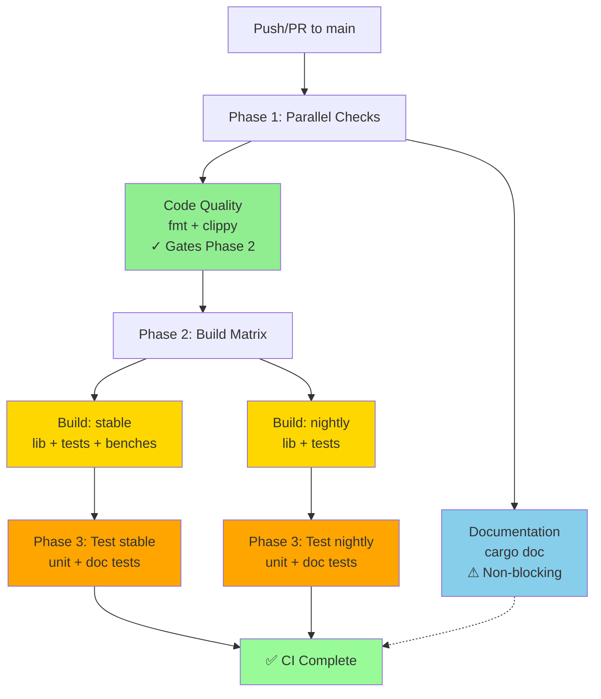
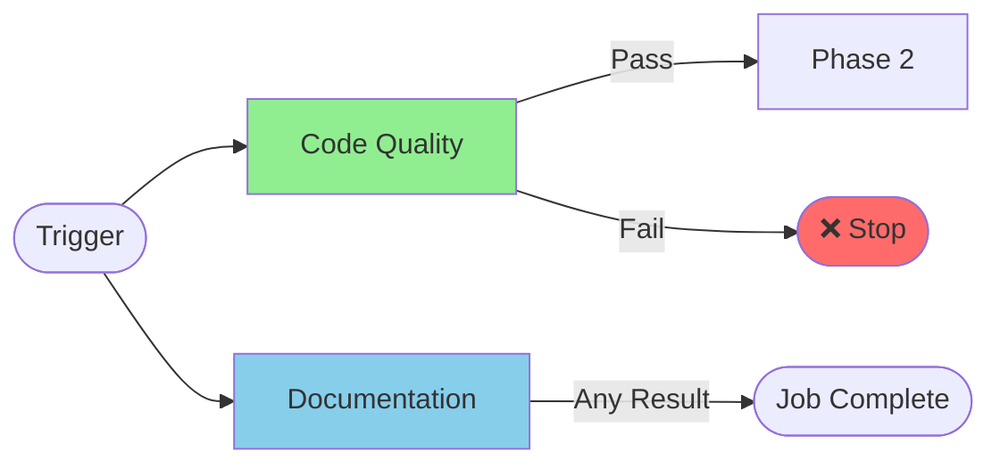
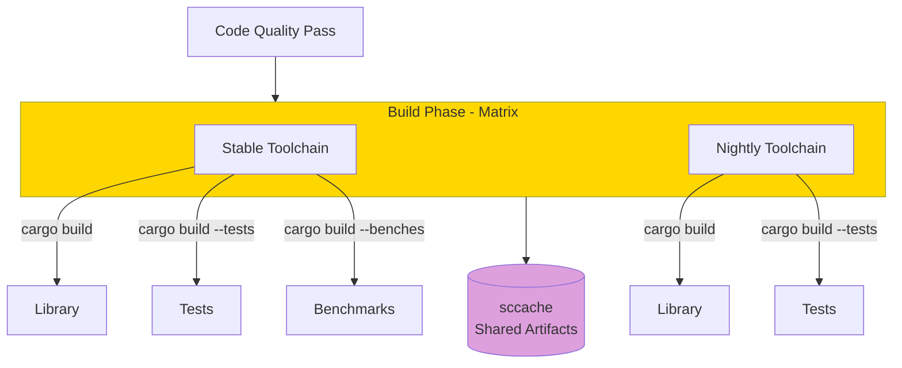
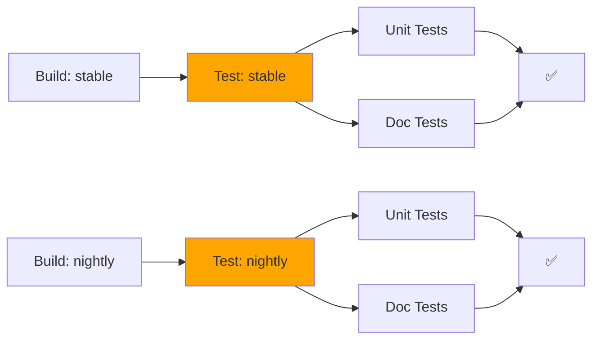
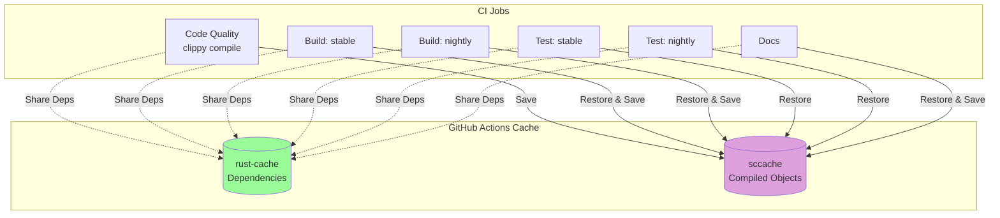
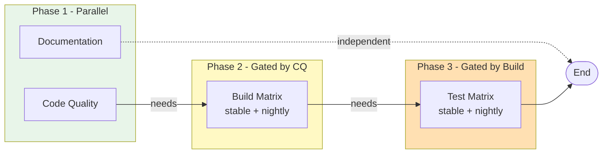

# CI Workflow Documentation

This document describes the continuous integration workflow for the compio-sync project.

## Overview

The CI pipeline is designed with a phased approach that maximizes parallelism and uses sccache for fast compilation across jobs.

## Workflow Diagram



## Pipeline Phases

### Phase 1: Parallel Quality Checks

Two jobs run in parallel at the start:



**Code Quality** (Blocking):
- Checks code formatting with `cargo fmt`
- Runs Clippy lints with strict warnings
- Uses sccache for compilation
- **Gates the build phase** - must pass for pipeline to continue

**Documentation** (Non-blocking):
- Builds documentation with `cargo doc`
- Checks for documentation warnings via `RUSTDOCFLAGS`
- Runs in parallel but doesn't block build/test phases
- Useful for catching doc issues early

### Phase 2: Build Matrix

Builds artifacts across different Rust toolchains after code quality passes:



- Builds library, tests, and benchmarks
- Uses sccache to cache compilation artifacts
- Matrix runs stable + nightly in parallel
- Benchmarks only built on stable toolchain

### Phase 3: Test Matrix

Runs tests using cached builds from Phase 2:



- Reuses compiled artifacts from build phase (via rust-cache + sccache)
- Runs unit tests and doc tests
- Matrix matches build phase toolchains

## sccache Integration

The workflow uses sccache to share compilation artifacts across jobs and phases:



### Cache Strategy

**sccache** (compilation cache):
- Cache key: `sccache-{OS}-{toolchain}-{Cargo.lock-hash}`
- Restore keys: Fall back to same OS + toolchain
- Stores compiled object files in `~/.cache/sccache`
- Shared across all jobs and phases

**rust-cache** (dependency cache):
- Cache key: `v1-compio-sync-{OS}-{toolchain}`
- Caches Cargo registry and git dependencies
- Caches workspace target directory
- Saved from all branches for maximum reuse

## Environment Variables

Global environment configuration for all jobs:

```yaml
env:
  CARGO_TERM_COLOR: always        # Colorized output
  RUST_BACKTRACE: 1               # Full backtraces on errors
  RUSTC_WRAPPER: sccache          # Enable sccache wrapper
  SCCACHE_GHA_ENABLED: "true"     # GitHub Actions optimizations
```

## Concurrency Control

```yaml
concurrency:
  group: ${{ github.workflow }}-${{ github.ref }}
  cancel-in-progress: true
```

Automatically cancels in-progress CI runs when new commits are pushed to the same branch/PR, saving CI minutes.

## Job Dependencies



- **Documentation** has no dependencies and doesn't block anything
- **Build** requires **Code Quality** to pass
- **Test** requires **Build** to complete
- All jobs use `fail-fast: false` to see all failures

## Platform Support

Currently configured for:
- **OS**: `ubuntu-latest`
- **Toolchains**: `stable`, `nightly`

Ready to expand to:
```yaml
matrix:
  os: [ubuntu-latest, windows-latest, macos-latest]
  rust: [stable, nightly]
```

## Performance Optimizations

1. **Parallel Phase 1**: Docs and linting run simultaneously
2. **sccache**: Shares compiled objects across jobs (~5-10x speedup on cache hits)
3. **rust-cache**: Avoids re-downloading dependencies
4. **Build Separation**: Tests don't rebuild, just run
5. **Concurrency Control**: Cancels outdated runs

## Monitoring

Each job includes sccache statistics output:

```yaml
- name: Show sccache statistics
  run: sccache --show-stats
  if: always()
```

Look for:
- **Cache hit rate**: Higher is better (>80% on warm cache)
- **Compile requests**: Total compilation units
- **Cache size**: Monitor cache growth

## Example Timeline

### Warm Cache Timeline

Typical execution times with warm cache (subsequent runs):

```mermaid
gantt
    title CI Pipeline Execution (Warm Cache)
    dateFormat X
    axisFormat %S s
    
    section Phase 1
    Code Quality    :0, 45s
    Documentation   :0, 40s
    
    section Phase 2
    Build stable    :45, 30s
    Build nightly   :45, 30s
    
    section Phase 3
    Test stable     :75, 20s
    Test nightly    :75, 20s
```



**Total time**: ~95 seconds (warm cache)

### Cold-start Timeline

First run with empty cache (typical):

- **Phase 1**: ~45-50s (clippy compilation, cache miss)
- **Phase 2**: ~3-5 min (full compilation, establishing cache)
- **Phase 3**: ~20-30s (run tests)
- **Total**: ~5-8 minutes (establishes baseline cache for future runs)

**Cache Improvement**: After the first run, subsequent builds are ~5-10x faster due to sccache hits.

## Troubleshooting

### Cache Miss Issues

If sccache shows low hit rates:
1. Check if `Cargo.lock` was modified (invalidates cache key)
2. Verify `RUSTC_WRAPPER=sccache` is set
3. Look for cache size limits in GitHub Actions

### Build Failures

- **Code Quality fails**: Check formatting and clippy locally
- **Build fails**: Usually indicates a real compilation error
- **Test fails**: Run `cargo test` locally to reproduce

### Documentation Failures

Run locally with:
```bash
RUSTDOCFLAGS="-D warnings" cargo doc --no-deps --all-features
```

## Related Files

- **Workflow**: `.github/workflows/ci.yml`
- **Composite Action**: `.github/actions/setup-rust-sccache/action.yml`
- **Setup Documentation**: `.github/SCCACHE_SETUP.md`

