# GitHub Actions Documentation

This directory contains GitHub Actions workflows and documentation for the compio-sync project.

## 📚 Documentation

- **[CI Workflow](CI_WORKFLOW.md)** - Visual documentation of the CI pipeline with Mermaid diagrams
- **[sccache Setup](SCCACHE_SETUP.md)** - Technical details about sccache integration and caching strategy

## 🔧 Workflows

- **[ci.yml](workflows/ci.yml)** - Main CI pipeline (lint, build, test, docs)

## 🎨 Composite Actions

- **[setup-rust-sccache](actions/setup-rust-sccache/action.yml)** - Reusable action for Rust toolchain setup with sccache

## CI Pipeline Overview

```mermaid
graph LR
    A[Push/PR] --> B[Code Quality]
    A --> C[Documentation]
    B --> D[Build Matrix]
    D --> E[Test Matrix]
    E --> F[✅ Done]
    C -.-> F
    
    style B fill:#90EE90
    style C fill:#87CEEB
    style D fill:#FFD700
    style E fill:#FFA500
```

See [CI_WORKFLOW.md](CI_WORKFLOW.md) for detailed documentation with interactive diagrams.

## Quick Links

- [Understanding sccache cache strategy](SCCACHE_SETUP.md#cache-strategy)
- [CI pipeline phases](CI_WORKFLOW.md#pipeline-phases)
- [Performance optimizations](CI_WORKFLOW.md#performance-optimizations)
- [Troubleshooting guide](CI_WORKFLOW.md#troubleshooting)

